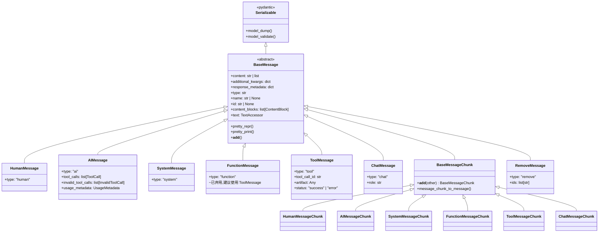
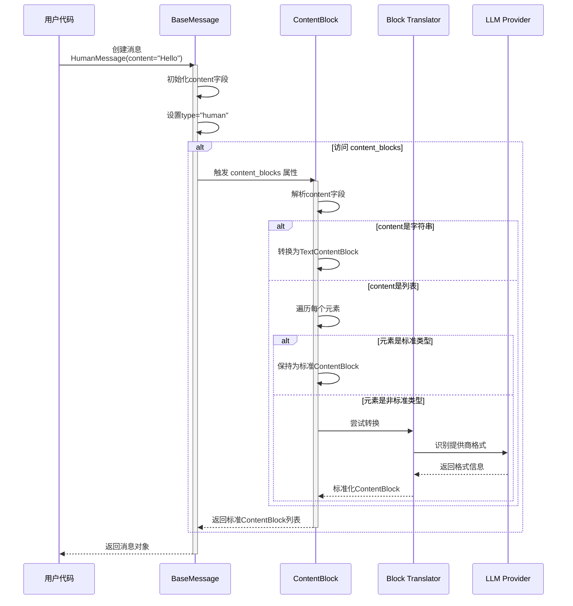
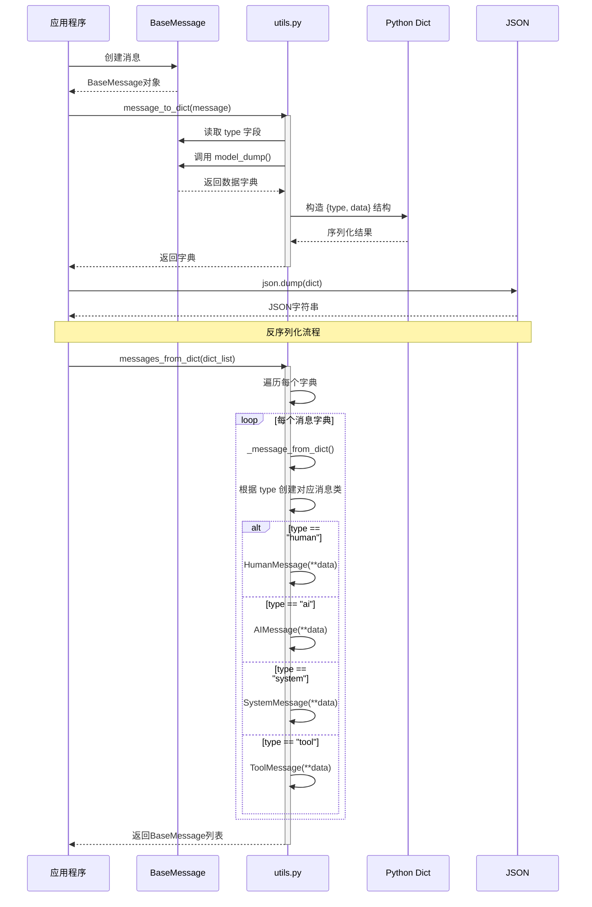
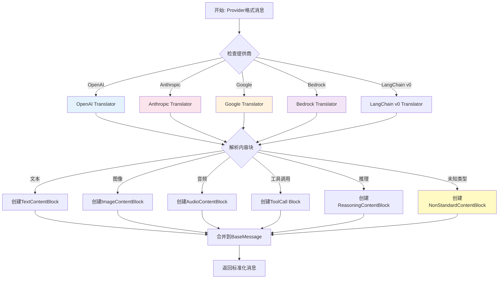
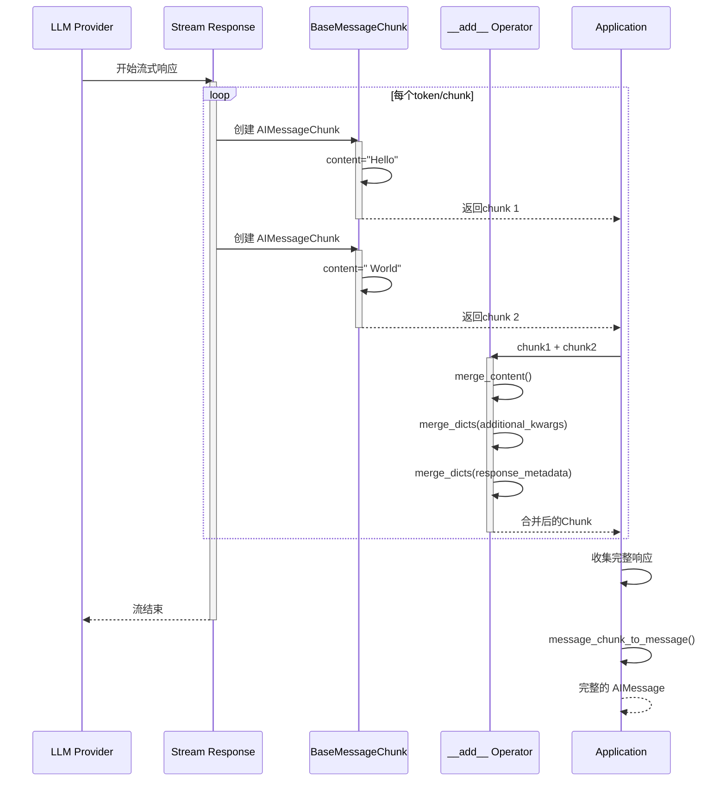
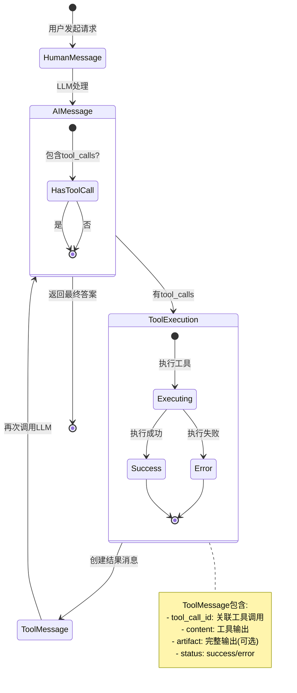
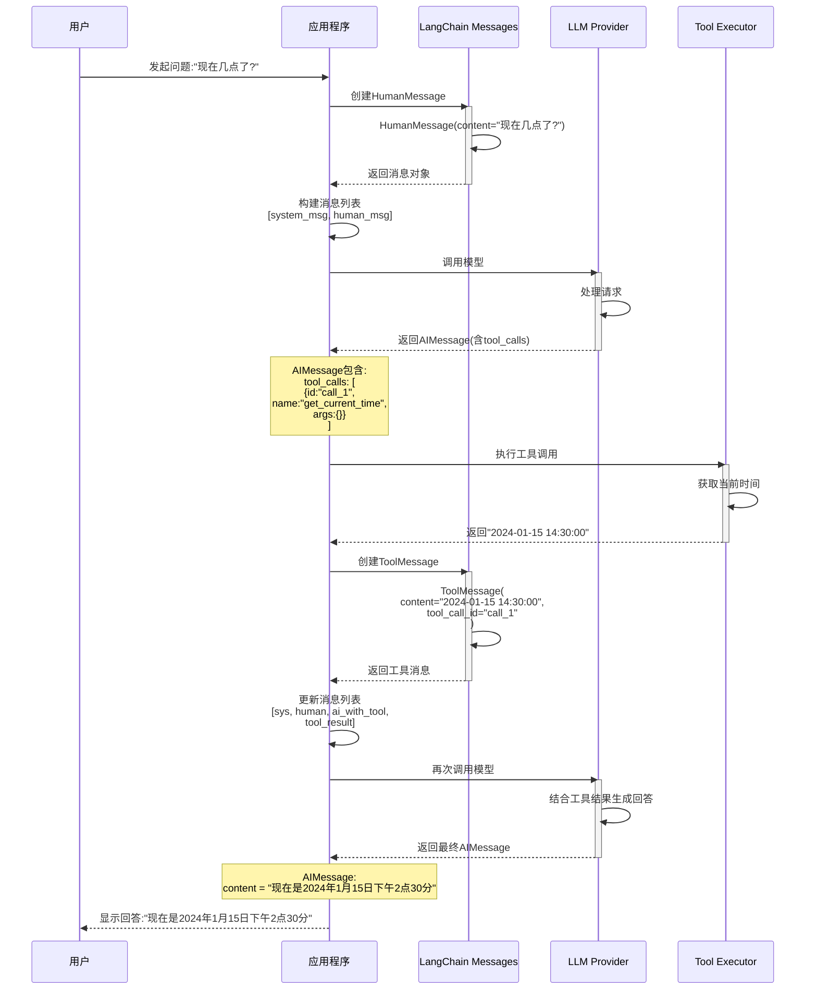
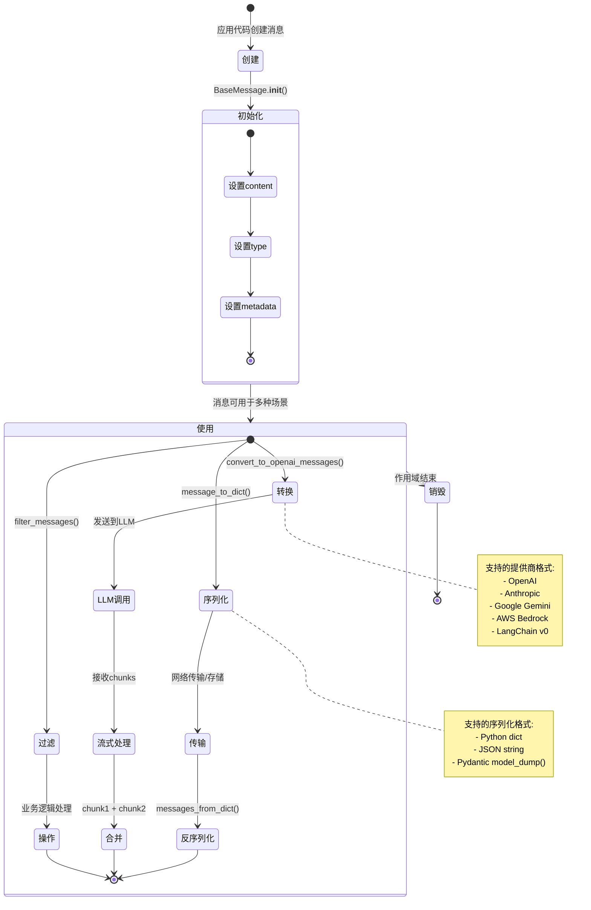

# LangChain Core Messages 消息系统架构设计概要

## 1. 系统概述

`langchain_core.messages` 模块是 LangChain 框架中用于表示和管理 LLM(大语言模型)输入输出的核心模块。它提供了标准化的消息数据结构,支持多模态内容(文本、图像、音频、视频等),并实现了不同 LLM 提供商之间的统一抽象层。

### 核心设计理念

1. **统一抽象**: 为不同 LLM 提供商(OpenAI、Anthropic、Google等)提供统一的消息格式
2. **多模态支持**: 原生支持文本、图像、音频、视频、文件等多种内容类型
3. **可扩展性**: 通过 `ContentBlock` 机制支持标准和非标准内容块
4. **流式处理**: 支持 Message Chunk 的流式拼接和合并
5. **序列化**: 完整的序列化/反序列化支持,便于持久化和传输

---

## 2. 静态结构

### 2.1 核心类层次结构

```
BaseMessage (Serializable)
├── 通用消息属性
│   ├── content: str | list[str | dict]
│   ├── additional_kwargs: dict
│   ├── response_metadata: dict
│   ├── type: str
│   ├── name: str | None
│   └── id: str | None
│
├── 具体消息类型
│   ├── HumanMessage          # 用户消息
│   │   └── HumanMessageChunk
│   ├── AIMessage             # AI回复消息
│   │   ├── tool_calls: list[ToolCall]
│   │   ├── invalid_tool_calls: list[InvalidToolCall]
│   │   ├── usage_metadata: UsageMetadata
│   │   └── AIMessageChunk
│   ├── SystemMessage         # 系统提示消息
│   │   └── SystemMessageChunk
│   ├── FunctionMessage       # 函数调用消息(已弃用)
│   │   └── FunctionMessageChunk
│   ├── ToolMessage           # 工具执行结果消息
│   │   ├── tool_call_id: str
│   │   ├── artifact: Any
│   │   ├── status: "success" | "error"
│   │   └── ToolMessageChunk
│   ├── ChatMessage           # 通用聊天消息
│   │   ├── role: str
│   │   └── ChatMessageChunk
│   └── RemoveMessage         # 消息移除标记
│
└── BaseMessageChunk
    └── 支持 + 操作符进行消息拼接
```

### 2.2 ContentBlock 类型系统

```
ContentBlock (TypedDict)
├── TextContentBlock          # 文本内容块
│   ├── type: "text"
│   ├── text: str
│   └── annotations: list[Annotation]
│
├── ImageContentBlock         # 图像内容块
│   ├── type: "image"
│   ├── url: str | None
│   ├── image_url: str | None
│   ├── image: str | None
│   ├── mime_type: str | None
│   └── data: str | None
│
├── AudioContentBlock         # 音频内容块
│   ├── type: "audio"
│   └── (类似 ImageContentBlock 结构)
│
├── VideoContentBlock         # 视频内容块
│   └── (类似 AudioContentBlock 结构)
│
├── FileContentBlock          # 文件内容块
│   └── (PDF等文件类型)
│
├── PlainTextContentBlock     # 纯文本文件块
│   └── (.txt, .md等)
│
├── DataContentBlock          # 通用数据块
│   └── (is_data_content_block() 判断)
│
├── ReasoningContentBlock     # 推理内容块
│   ├── type: "reasoning"
│   └── reasoning: str
│
├── Citation                  # 引用注解
│   ├── type: "citation"
│   ├── url: str
│   ├── title: str
│   ├── start_index: int
│   ├── end_index: int
│   └── cited_text: str
│
├── ToolCall                  # 工具调用
│   ├── type: "tool_call"
│   ├── id: str
│   ├── name: str
│   ├── args: dict
│   └── index: int | None
│
├── ServerToolCall            # 服务器端工具调用
│   └── (扩展的 ToolCall)
│
├── ServerToolResult          # 服务器端工具结果
│   └── (工具执行结果)
│
├── NonStandardContentBlock   # 非标准内容块
│   ├── type: "non_standard"
│   └── value: dict
│
└── NonStandardAnnotation     # 非标准注解
    └── type: "non_standard_annotation"
```

### 2.3 模块文件结构

```
langchain_core/messages/
├── __init__.py                  # 模块入口,动态导入
├── base.py                      # BaseMessage 和 BaseMessageChunk
├── human.py                     # HumanMessage
├── ai.py                        # AIMessage
├── system.py                    # SystemMessage
├── function.py                  # FunctionMessage(已弃用)
├── tool.py                      # ToolMessage 和 ToolCall
├── chat.py                      # ChatMessage
├── modifier.py                  # RemoveMessage
├── content.py                   # ContentBlock 类型定义
├── utils.py                     # 工具函数(转换、过滤等)
└── block_translators/           # 不同提供商的内容块转换器
    ├── __init__.py
    ├── openai.py                # OpenAI 格式转换
    ├── anthropic.py             # Anthropic 格式转换
    ├── google_genai.py          # Google Gemini 格式转换
    ├── google_vertexai.py       # Google VertexAI 格式转换
    ├── bedrock.py               # AWS Bedrock 格式转换
    ├── bedrock_converse.py      # Bedrock Converse API 格式转换
    ├── groq.py                  # Groq 格式转换
    └── langchain_v0.py          # LangChain v0 旧版格式兼容
```

---

## 3. 架构图

### 3.1 消息系统整体架构

```mermaid
graph TB
    subgraph "LLM Provider APIs"
        OpenAI[OpenAI API]
        Anthropic[Anthropic API]
        Google[Google Gemini API]
        AWS[AWS Bedrock API]
    end

    subgraph "Block Translators"
        OpenAI_BT[OpenAI Translator]
        Anthropic_BT[Anthropic Translator]
        Google_BT[Google Translator]
        AWS_BT[Bedrock Translator]
    end

    subgraph "Content Blocks"
        Text[TextContentBlock]
        Image[ImageContentBlock]
        Audio[AudioContentBlock]
        Video[VideoContentBlock]
        Tool[ToolCall Block]
        Citation[Citation Block]
    end

    subgraph "Message Types"
        Human[HumanMessage]
        AI[AIMessage]
        System[SystemMessage]
        Tool[ToolMessage]
    end

    subgraph "Base Message"
        Base[BaseMessage<br/>content: str|list<br/>additional_kwargs<br/>response_metadata<br/>type, name, id]
        Chunk[BaseMessageChunk<br/>支持 __add__ 拼接]
    end

    subgraph "Utils"
        Convert[convert_to_messages<br/>convert_to_openai_messages]
        Filter[filter_messages<br/>trim_messages]
        Serialize[message_to_dict<br/>messages_from_dict]
    end

    OpenAI -->|provider specific format| OpenAI_BT
    Anthropic -->|provider specific format| Anthropic_BT
    Google -->|provider specific format| Google_BT
    AWS -->|provider specific format| AWS_BT

    OpenAI_BT -->|standard blocks| Text
    Anthropic_BT -->|standard blocks| Image
    Google_BT -->|standard blocks| Audio
    AWS_BT -->|standard blocks| Video

    Text --> Base
    Image --> Base
    Audio --> Base
    Video --> Base
    Tool --> Base
    Citation --> Base

    Base --> Human
    Base --> AI
    Base --> System
    Base --> Tool

    Base --> Chunk

    Human --> Convert
    AI --> Filter
    System --> Serialize
    Tool --> Convert

    style Base fill:#e1f5ff
    style Chunk fill:#e1f5ff
    style Text fill:#fff4e6
    style Image fill:#fff4e6
    style Audio fill:#fff4e6
    style Video fill:#fff4e6
```

### 3.2 消息类型继承关系图



### 3.3 ContentBlock 类型系统架构

```mermaid
graph TB
    subgraph "标准内容块"
        Text[TextContentBlock<br/>type: text<br/>text: str]
        Image[ImageContentBlock<br/>type: image<br/>url/image/data]
        Audio[AudioContentBlock<br/>type: audio]
        Video[VideoContentBlock<br/>type: video]
        File[FileContentBlock<br/>type: file]
        PlainText[PlainTextContentBlock<br/>type: plain_text]
        Data[DataContentBlock<br/>type: data]
        Reasoning[ReasoningContentBlock<br/>type: reasoning]
    end

    subgraph "工具相关"
        ToolCall[ToolCall<br/>type: tool_call<br/>id, name, args]
        ServerToolCall[ServerToolCall<br/>扩展字段]
        ServerToolResult[ServerToolResult<br/>执行结果]
    end

    subgraph "注解系统"
        Citation[Citation<br/>type: citation<br/>url, start/end_index]
        Annotation[Annotation<br/>基础注解类型]
    end

    subgraph "非标准类型"
        NonStandard[NonStandardContentBlock<br/>type: non_standard<br/>value: dict]
        NonStandardAnnotation[NonStandardAnnotation<br/>type: non_standard_annotation]
    end

    Base[ContentBlock<br/>TypedDict] --> Text
    Base --> Image
    Base --> Audio
    Base --> Video
    Base --> File
    Base --> PlainText
    Base --> Data
    Base --> Reasoning
    Base --> ToolCall
    Base --> ServerToolCall
    Base --> ServerToolResult
    Base --> Citation
    Base --> Annotation
    Base --> NonStandard
    Base --> NonStandardAnnotation

    Extras[extras: dict<br/>提供商特定字段] -.-> Text
    Extras -.-> Image
    Extras -.-> Audio
    Extras -.-> Video
    Extras -.-> ToolCall

    style Base fill:#e8f4f8
    style NonStandard fill:#fff4e6
    style Extras fill:#f0f0f0,stroke-dasharray: 5 5
```



---

## 4. 运作逻辑

### 4.1 消息创建流程



### 4.2 消息序列化流程



### 4.3 消息转换流程 (跨提供商)



### 4.4 消息块流式处理流程



### 4.5 工具调用消息流转



---

## 5. 简单调用示例

### 5.1 基础消息创建和使用

```python
from langchain_core.messages import HumanMessage, AIMessage, SystemMessage

# 1. 创建系统消息
system_msg = SystemMessage(content="你是一个友好的AI助手")

# 2. 创建用户消息(支持多模态)
human_msg = HumanMessage(content=[
    {"type": "text", "text": "这张图片里有什么?"},
    {
        "type": "image",
        "source": {
            "type": "base64",
            "media_type": "image/jpeg",
            "data": "/9j/4AAQSkZJRg..."
        }
    }
])

# 3. 模拟AI响应
ai_msg = AIMessage(content="这是一张猫的照片")

# 4. 访问消息属性
print(f"消息类型: {ai_msg.type}")
print(f"消息内容: {ai_msg.text}")
print(f"内容块: {ai_msg.content_blocks}")
```

### 5.2 工具调用示例

```python
from langchain_core.messages import HumanMessage, AIMessage, ToolMessage
from langchain_core.messages.tool import ToolCall

# 1. 用户消息
user_msg = HumanMessage(content="现在天气怎么样?")

# 2. AI决定调用工具
ai_with_tool = AIMessage(
    content="让我查询一下天气信息",
    tool_calls=[
        ToolCall(
            id="call_123",
            name="get_weather",
            args={"city": "北京", "unit": "celsius"}
        )
    ]
)

# 3. 工具执行结果
tool_result = ToolMessage(
    content="北京今天晴天,气温25°C",
    tool_call_id="call_123"
)

# 4. AI最终回复
final_response = AIMessage(
    content="根据查询结果,北京今天是晴天,气温25°C,很适合外出!"
)

# 消息序列
messages = [user_msg, ai_with_tool, tool_result, final_response]
```

### 5.3 消息序列化和反序列化

```python
from langchain_core.messages import (
    HumanMessage, AIMessage,
    messages_to_dict, messages_from_dict
)
import json

# 创建消息列表
messages = [
    HumanMessage(content="你好"),
    AIMessage(content="你好!有什么可以帮你的?")
]

# 序列化为字典
msg_dicts = messages_to_dict(messages)
print(msg_dicts)
# 输出:
# [
#   {"type": "human", "data": {"content": "你好", ...}},
#   {"type": "ai", "data": {"content": "你好!有什么可以帮你的?", ...}}
# ]

# 序列化为JSON
json_str = json.dumps(msg_dicts, ensure_ascii=False, indent=2)

# 反序列化
restored_messages = messages_from_dict(msg_dicts)
print(f"恢复的消息数量: {len(restored_messages)}")
```

### 5.4 流式消息合并示例

```python
from langchain_core.messages import AIMessageChunk

# 模拟流式响应的chunks
chunk1 = AIMessageChunk(content="你好")
chunk2 = AIMessageChunk(content=",我是")
chunk3 = AIMessageChunk(content="AI助手")

# 使用 + 操作符合并
merged_chunk = chunk1 + chunk2 + chunk3
print(f"合并后内容: {merged_chunk.content}")  # "你好,我是AI助手"

# 或者使用列表合并
chunks = [chunk1, chunk2, chunk3]
final_chunk = chunk1 + chunks  # 支持批量合并
```

### 5.5 消息过滤和转换

```python
from langchain_core.messages.utils import filter_messages, get_buffer_string
from langchain_core.messages import HumanMessage, AIMessage, SystemMessage

messages = [
    SystemMessage(content="系统提示", name="system"),
    HumanMessage(content="用户问题1", name="user1"),
    AIMessage(content="AI回答1"),
    HumanMessage(content="用户问题2", name="user2"),
    AIMessage(content="AI回答2"),
]

# 1. 按类型过滤
from langchain_core.messages import AIMessage
ai_messages = filter_messages(messages, include_types=["ai"])
print(f"AI消息数量: {len(ai_messages)}")

# 2. 按名称过滤
user1_messages = filter_messages(messages, names=["user1"])
print(f"来自user1的消息: {len(user1_messages)}")

# 3. 转换为字符串格式
buffer_str = get_buffer_string(messages)
print(buffer_str)
# 输出:
# System: 系统提示
# Human: 用户问题1
# AI: AI回答1
# Human: 用户问题2
# AI: AI回答2
```

---

## 6. 调用示例流程图

### 6.1 完整的对话流程示例



### 6.2 多模态消息处理流程

```mermaid
flowchart LR
    Start[用户输入] --> Input{输入类型}

    Input -->|纯文本| TextMsg[HumanMessage<br/>content="text"]
    Input -->|文本+图片| MultiMsg[HumanMessage<br/>content=[<br/>  text_block,<br/>  image_block<br/>]]
    Input -->|文本+音频| AudioMsg[HumanMessage<br/>content=[<br/>  text_block,<br/>  audio_block<br/>]]

    TextMsg --> Blocks[content_blocks属性]
    MultiMsg --> Blocks
    AudioMsg --> Blocks

    Blocks --> Parse{解析内容块}

    Parse -->|TextContentBlock| Validate1[验证text字段]
    Parse -->|ImageContentBlock| Validate2[验证url/data字段]
    Parse -->|AudioContentBlock| Validate3[验证audio字段]
    Parse -->|非标准类型| Translate[通过Translator转换]

    Validate1 --> Standard[标准化ContentBlock]
    Validate2 --> Standard
    Validate3 --> Standard
    Translate --> Standard

    Standard --> LLM[发送到LLM]

    Translate -.转换失败.-> NonStd[保留为<br/>NonStandardContentBlock]
    NonStd --> LLM

    LLM --> Response[LLM响应]

    style MultiMsg fill:#e1f5ff
    style AudioMsg fill:#fff4e6
    style Translate fill:#fff9c4
    style NonStd fill:#ffebee
```

### 6.3 消息流转完整生命周期



---

## 7. 核心设计模式

### 7.1 使用的设计模式

1. **模板方法模式**: `BaseMessage` 定义模板,子类实现特定类型
2. **策略模式**: 不同提供商的 `Block Translator` 实现不同转换策略
3. **工厂模式**: `create_*_block()` 工厂函数创建 ContentBlock
4. **装饰器模式**: `TextAccessor` 为字符串添加额外行为
5. **适配器模式**: `Block Translator` 将提供商格式适配为标准格式
6. **组合模式**: 消息内容由多个 ContentBlock 组成

### 7.2 扩展性设计

1. **ContentBlock 扩展**: 通过 `NonStandardContentBlock` 支持未知类型
2. **extras 字段**: 每个 ContentBlock 都有 `extras` 字段存储提供商特定数据
3. **动态导入**: `__init__.py` 使用延迟导入优化加载性能
4. **插件式 Translator**: 新增提供商只需添加新的 translator 文件

---

## 8. 最佳实践建议

### 8.1 创建消息

1. **优先使用类型化构造**: 使用 `content_blocks` 参数获得更好的类型检查
2. **多模态内容**: 使用列表形式混合不同类型的内容块
3. **设置合理metadata**: 利用 `additional_kwargs` 存储提供商特定信息

### 8.2 处理流式响应

1. **及时合并chunks**: 使用 `+` 操作符或累积合并
2. **处理tool_calls**: 流式响应中的 tool_calls 可能分多次到达
3. **监控usage_metadata**: 跟踪token使用情况

### 8.3 序列化和持久化

1. **使用标准序列化**: `messages_to_dict()` → JSON → 存储
2. **包含类型信息**: 序列化时保留 `type` 字段便于反序列化
3. **处理非标准块**: 注意 `NonStandardContentBlock` 可能无法完全恢复

### 8.4 跨提供商兼容性

1. **使用标准ContentBlock**: 避免使用提供商特定的字段
2. **测试转换**: 验证 `convert_to_*_messages()` 的结果
3. **处理失败情况**: 部分高级特性可能在某些提供商不支持

---

## 9. 总结

`langchain_core.messages` 模块通过精心设计的层次结构和 ContentBlock 系统,实现了:

- ✅ **统一抽象**: 屏蔽不同LLM提供商的差异
- ✅ **多模态支持**: 原生支持文本、图像、音频、视频等
- ✅ **流式处理**: 高效的流式响应处理机制
- ✅ **可扩展性**: 通过 ContentBlock 和 Translator 机制支持扩展
- ✅ **类型安全**: 基于 Pydantic 和 TypedDict 提供强类型支持

该模块是 LangChain 框架与 LLM 交互的基石,为上层应用提供了可靠、灵活的消息处理能力。
