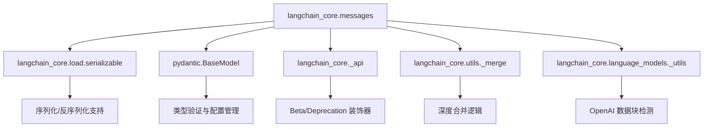
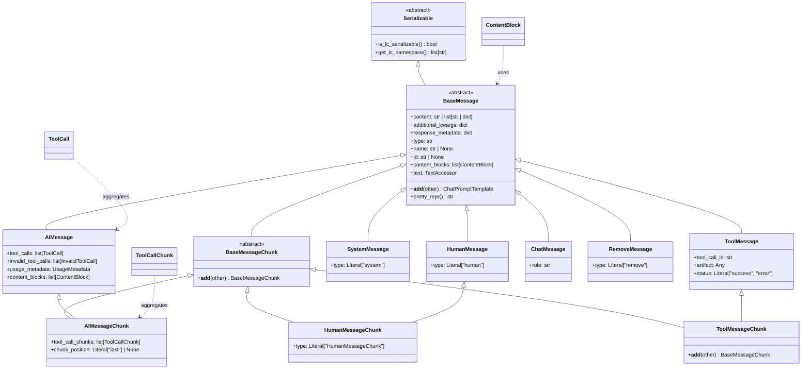
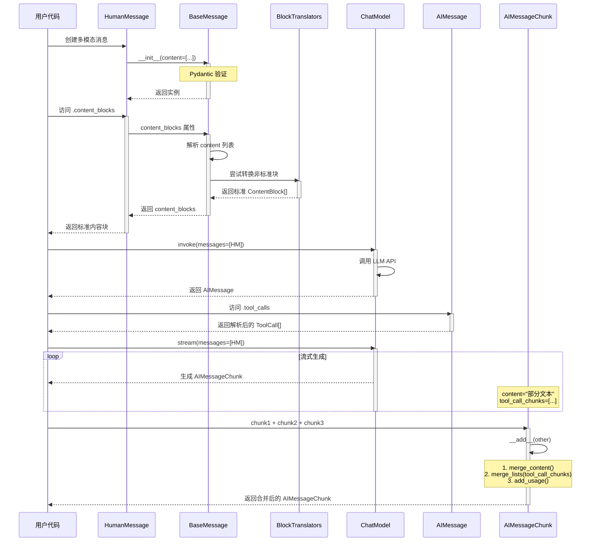

# LangChain 消息系统设计与原理分析

> **分析对象**: `langchain_core/messages` 模块
> **核心职责**: 提供标准化的消息表示、多模态内容支持、流式处理能力以及跨提供商的消息格式转换
> **版本**: langchain-core >= 1.0.0

---

## Section 1: 静态架构透视 (Macro Architecture)

### 1.1 模块职责

`langchain_core/messages` 模块是 LangChain 生态系统中**消息表示层的核心抽象**。它解决了以下关键问题:

1. **统一消息表示**: 为不同类型的消息(用户、AI、系统、工具等)提供统一的抽象基类
2. **多模态内容支持**: 支持文本、图像、音频、视频、文件等多种内容类型的组合
3. **流式处理**: 提供消息分块(MessageChunk)机制,支持增量式内容生成
4. **跨提供商兼容**: 通过 Content Block 标准化和 Block Translators 实现 OpenAI、Anthropic、Google 等不同 API 格式的转换
5. **工具调用协议**: 定义标准的工具调用(Tool Call)表示,支持 Function Calling 能力
6. **序列化与持久化**: 基于 Pydantic 实现消息的序列化/反序列化

### 1.2 核心文件映射

| 文件 | 职责 | 关键类/函数 |
|------|------|------------|
| **[base.py](langchain_core/messages/base.py)** | 定义消息系统的根基抽象 | `BaseMessage`, `BaseMessageChunk`, `merge_content()` |
| **[content.py](langchain_core/messages/content.py)** | 定义标准化的内容块类型 | `TextContentBlock`, `ImageContentBlock`, `ToolCall`, `ContentBlock` (Union) |
| **[ai.py](langchain_core/messages/ai.py)** | AI 消息实现,支持工具调用 | `AIMessage`, `AIMessageChunk`, `UsageMetadata` |
| **[human.py](langchain_core/messages/human.py)** | 用户消息实现 | `HumanMessage`, `HumanMessageChunk` |
| **[tool.py](langchain_core/messages/tool.py)** | 工具消息实现 | `ToolMessage`, `ToolCall`, `ToolCallChunk` |
| **[system.py](langchain_core/messages/system.py)** | 系统消息实现 | `SystemMessage`, `SystemMessageChunk` |
| **[utils.py](langchain_core/messages/utils.py)** | 消息处理工具集 | `convert_to_messages()`, `filter_messages()`, `trim_messages()`, `merge_message_runs()` |
| **[block_translators/](langchain_core/messages/block_translators/)** | 跨提供商格式转换器 | `convert_to_openai_data_block()`, `_convert_to_v1_from_anthropic_input()` |

### 1.3 依赖关系



**关键依赖说明**:

1. **`Serializable` ([load/serializable.py](langchain_core/load/serializable.py))**: 所有消息类的基类,提供 `is_lc_serializable()` 和 `get_lc_namespace()` 方法
2. **`Pydantic BaseModel`**: 提供数据验证、JSON 序列化、`model_validator` 装饰器
3. **`langchain_core.utils._merge`**: 提供 `merge_dicts()` 和 `merge_lists()`,用于消息分块的合并
4. **`langchain_core._api`**: 提供 `@beta()` 和 `@deprecated()` 装饰器,用于 API 稳定性管理

---

## Section 2: 核心类与接口契约 (Class Design & Contracts)

### 2.1 类图构建



### 2.2 接口契约分析

#### 2.2.1 核心抽象基类: `BaseMessage`

**位置**: [base.py:93-330](langchain_core/messages/base.py#L93-L330)

**强制实现的字段**:
```python
content: str | list[str | dict]  # 消息内容,可以是字符串或内容块列表
type: str  # 消息类型标识符
```

**提供的通用功能**:

1. **内容块解析** (`content_blocks` 属性):
   - 将 `content` 转换为标准化的 `ContentBlock` 列表
   - 自动调用 Block Translators 处理不同提供商格式
   - 代码位置: [base.py:199-261](langchain_core/messages/base.py#L199-L261)

2. **文本提取** (`text` 属性):
   - 从消息中提取纯文本内容
   - 支持 `message.text` (属性) 和 `message.text()` (方法,已弃用) 两种访问方式
   - 使用 `TextAccessor` 实现向后兼容
   - 代码位置: [base.py:263-290](langchain_core/messages/base.py#L263-L290)

3. **序列化支持**:
   - 继承自 `Serializable`
   - 实现 `get_lc_namespace()` 返回 `["langchain", "schema", "messages"]`
   - 代码位置: [base.py:181-197](langchain_core/messages/base.py#L181-L197)

4. **消息拼接** (`__add__` 方法):
   - 支持消息与 `ChatPromptTemplate` 的拼接
   - 代码位置: [base.py:292-305](langchain_core/messages/base.py#L292-L305)

#### 2.2.2 流式处理基类: `BaseMessageChunk`

**位置**: [base.py:375-437](langchain_core/messages/base.py#L375-L437)

**核心方法**:

```python
def __add__(self, other: Any) -> BaseMessageChunk:
    """合并两个消息分块,包括 content、additional_kwargs、response_metadata"""
```

**关键特性**:
- 重载 `__add__` 实现分块合并
- 使用 `merge_content()` 合并内容(处理字符串和列表)
- 使用 `merge_dicts()` 合并元数据
- 自动合并 `tool_calls` 和 `usage_metadata` (在子类中)

#### 2.2.3 内容块系统: `ContentBlock` 联合类型

**位置**: [content.py:825-833](langchain_core/messages/content.py#L825-L833)

**类型定义**:
```python
ContentBlock = (
    TextContentBlock |
    InvalidToolCall |
    ReasoningContentBlock |
    NonStandardContentBlock |
    DataContentBlock |  # Image | Video | Audio | PlainText | File
    ToolContentBlock   # ToolCall | ToolCallChunk | ServerToolCall | ...
)
```

**核心内容块类型**:

| 类型 | 用途 | 关键字段 |
|------|------|---------|
| `TextContentBlock` | 文本内容 | `text: str`, `annotations: list[Annotation]` |
| `ImageContentBlock` | 图像数据 | `url: str`, `base64: str`, `file_id: str`, `mime_type: str` |
| `ToolCall` | 工具调用请求 | `name: str`, `args: dict`, `id: str` |
| `ToolCallChunk` | 流式工具调用片段 | `name: str | None`, `args: str | None`, `index: int | None` |
| `ReasoningContentBlock` | 推理内容 | `reasoning: str` |
| `NonStandardContentBlock` | 提供商特定格式 | `value: dict[str, Any]` |

### 2.3 设计模式识别

#### 2.3.1 模板方法模式 (Template Method)

**体现**: `BaseMessage.content_blocks` 属性

**代码位置**: [base.py:199-261](langchain_core/messages/base.py#L199-L261)

```python
@property
def content_blocks(self) -> list[types.ContentBlock]:
    # 1. 将 content 转换为列表
    # 2. 遍历每个 item,判断是标准块还是非标准块
    # 3. 对非标准块依次调用多个 Translator 进行转换
    for parsing_step in [
        _convert_v0_multimodal_input_to_v1,
        _convert_to_v1_from_chat_completions_input,
        _convert_to_v1_from_anthropic_input,
        _convert_to_v1_from_genai_input,
        _convert_to_v1_from_converse_input,
    ]:
        blocks = parsing_step(blocks)
    return blocks
```

**作用**: 定义内容解析的骨架,子类(如 `AIMessage`)可以覆盖此方法添加特殊逻辑

#### 2.3.2 策略模式 (Strategy Pattern)

**体现**: `Block Translators` 机制

**代码位置**: [block_translators/](langchain_core/messages/block_translators/)

**策略接口** (隐式):
```python
def translate_content(message: BaseMessage) -> list[ContentBlock]:
    """将特定提供商格式转换为 v1 标准格式"""
```

**具体策略**:
- `openai.py`: `_convert_to_v1_from_chat_completions_input()`
- `anthropic.py`: `_convert_to_v1_from_anthropic_input()`
- `google_genai.py`: `_convert_to_v1_from_genai_input()`

**使用场景**: [ai.py:252-263](langchain_core/messages/ai.py#L252-L263)
```python
model_provider = self.response_metadata.get("model_provider")
if model_provider:
    translator = get_translator(model_provider)
    if translator:
        return translator["translate_content"](self)
```

#### 2.3.3 装饰器模式 (Decorator Pattern)

**体现**: `TextAccessor` 类

**代码位置**: [base.py:47-91](langchain_core/messages/base.py#L47-L91)

```python
class TextAccessor(str):
    """字符串的装饰器,同时支持属性访问和方法调用"""

    def __call__(self) -> str:
        warn_deprecated(...)  # 调用方法时发出警告
        return str(self)
```

**作用**:
- 继承 `str` 保持字符串行为
- 添加 `__call__` 方法支持旧版 API (`message.text()`)
- 实现平滑的 API 迁移

#### 2.3.4 适配器模式 (Adapter Pattern)

**体现**: `convert_to_openai_messages()` 函数

**代码位置**: [utils.py:1022-1397](langchain_core/messages/utils.py#L1022-L1397)

**作用**: 将 LangChain 标准消息格式适配为 OpenAI API 格式
- 处理不同 `ContentBlock` 类型
- 转换 `ToolCall` 为 OpenAI 的 `tool_calls` 格式
- 支持 `text_format` 参数控制输出格式

#### 2.3.5 工厂模式 (Factory Pattern)

**体现**: Content Block 工厂函数

**代码位置**: [content.py:931-1423](langchain_core/messages/content.py#L931-L1423)

**示例**:
```python
def create_text_block(text: str, *, id: str | None = None, ...) -> TextContentBlock:
    """自动生成 ID,验证必填字段"""

def create_image_block(*, url: str | None = None, base64: str | None = None, ...) -> ImageContentBlock:
    """验证至少提供一种图片来源"""
```

**优势**:
- 自动生成 ID (`ensure_id()`)
- 运行时参数验证
- 简化对象创建

---

## Section 3: 动态运作流程 (Dynamic Execution Flow)

### 3.1 场景设定

**场景**: 用户创建一个包含多模态内容的 `HumanMessage`,并通过 Chat Model 调用后获得包含工具调用的 `AIMessage`,然后通过流式处理接收多个 `AIMessageChunk`。

### 3.2 调用栈模拟

#### 流程 1: 创建多模态 HumanMessage

```python
# 用户代码
message = HumanMessage(content=[
    {"type": "text", "text": "分析这张图片"},
    {"type": "image", "url": "https://example.com/image.png"}
])
```

**调用流程**:

1. **`HumanMessage.__init__`** ([human.py:47-60](langchain_core/messages/human.py#L47-L60))
   ```python
   def __init__(self, content=None, content_blocks=None, **kwargs):
       if content_blocks is not None:
           super().__init__(content=content_blocks, **kwargs)
       else:
           super().__init__(content=content, **kwargs)
   ```

2. **`BaseMessage.__init__`** ([base.py:161-179](langchain_core/messages/base.py#L161-L179))
   - Pydantic 自动验证 `content` 字段
   - 设置 `additional_kwargs`, `response_metadata` 等默认值

3. **访问 `message.content_blocks`** (延迟执行,首次访问时触发)
   - 触发 [base.py:199-261](langchain_core/messages/base.py#L199-L261) 的属性解析
   - 检查是否为标准 v1 格式
   - 如果不是,调用 Block Translators 尝试转换

#### 流程 2: 接收包含工具调用的 AIMessage

```python
# 假设从 ChatModel 返回
ai_message = AIMessage(
    content="我需要调用工具来帮助您",
    tool_calls=[
        {"name": "search", "args": {"query": "example"}, "id": "call_123"}
    ]
)
```

**关键逻辑**:

1. **向后兼容处理** ([ai.py:301-345](langchain_core/messages/ai.py#L301-L345))
   ```python
   @model_validator(mode="before")
   @classmethod
   def _backwards_compat_tool_calls(cls, values: dict):
       # 从 additional_kwargs 提取旧版 tool_calls
       if raw_tool_calls := values.get("additional_kwargs", {}).get("tool_calls"):
           values["tool_calls"] = default_tool_parser(raw_tool_calls)
       # 确保所有 tool_call 都有 "type" 字段
       values["tool_calls"] = [
           create_tool_call(**{k: v for k, v in tc.items() if k not in ("type", "extras")})
           for tc in tool_calls
       ]
   ```

2. **构建 `content_blocks`** ([ai.py:242-298](langchain_core/messages/ai.py#L242-L298))
   - 检查 `response_metadata["output_version"]` 是否为 "v1"
   - 如果有 `model_provider`,尝试使用对应 Translator
   - 否则调用父类的 `content_blocks`,然后补充 `tool_calls`

#### 流程 3: 流式处理与分块合并

```python
# 流式调用模型
chunk1 = AIMessageChunk(content="我", tool_call_chunks=[{"name": "search", "args": '{"', "index": 0}])
chunk2 = AIMessageChunk(content="需要", tool_call_chunks=[{"args": 'query"}', "index": 0}])
chunk3 = AIMessageChunk(content="帮助", tool_call_chunks=[{"args': ':", "index": 0}])
chunk4 = AIMessageChunk(content="您", tool_call_chunks=[{"args": '"example"}', "index": 0}])

# 合并分块
merged = chunk1 + chunk2 + chunk3 + chunk4
```

**合并逻辑** ([ai.py:609-690](langchain_core/messages/ai.py#L609-L690)):

1. **内容合并**: 使用 `merge_content(chunk1.content, chunk2.content, ...)`
2. **Tool Call 合并**:
   ```python
   # 按 index 分组
   raw_tool_calls = merge_lists(left.tool_call_chunks, *(o.tool_call_chunks for o in others))
   # 重组为 ToolCallChunk 对象
   tool_call_chunks = [create_tool_call_chunk(**rtc) for rtc in raw_tool_calls]
   ```
3. **Usage Metadata 合并**: 使用 `add_usage(left.usage_metadata, right.usage_metadata)`

### 3.3 时序图



### 3.4 关键代码锚点

#### 锚点 1: Content Blocks 解析核心逻辑

**文件**: [base.py:199-261](langchain_core/messages/base.py#L199-L261)

**为什么关键**:
- 这是 LangChain 实现跨提供商兼容性的核心
- 通过责任链模式依次尝试不同的 Translator
- 决定了消息内容如何被标准化

```python
@property
def content_blocks(self) -> list[types.ContentBlock]:
    # 导入所有 Translator (避免循环导入)
    from langchain_core.messages.block_translators.anthropic import _convert_to_v1_from_anthropic_input
    from langchain_core.messages.block_translators.bedrock_converse import _convert_to_v1_from_converse_input
    from langchain_core.messages.block_translators.google_genai import _convert_to_v1_from_genai_input
    from langchain_core.messages.block_translators.openai import _convert_to_v1_from_chat_completions_input

    blocks: list[types.ContentBlock] = []
    # 第一遍: 识别标准块
    for item in content:
        if isinstance(item, str):
            blocks.append({"type": "text", "text": item})
        elif isinstance(item, dict):
            if item.get("type") not in types.KNOWN_BLOCK_TYPES:
                blocks.append({"type": "non_standard", "value": item})
            else:
                blocks.append(item)

    # 第二遍: 尝试转换非标准块
    for parsing_step in [
        _convert_v0_multimodal_input_to_v1,
        _convert_to_v1_from_chat_completions_input,
        _convert_to_v1_from_anthropic_input,
        _convert_to_v1_from_genai_input,
        _convert_to_v1_from_converse_input,
    ]:
        blocks = parsing_step(blocks)
    return blocks
```

#### 锚点 2: Tool Call Chunk 合并逻辑

**文件**: [ai.py:630-644](langchain_core/messages/ai.py#L630-L644)

**为什么关键**:
- 实现了流式场景下工具调用的增量构建
- 通过 `index` 字段将多个 chunk 聚合为完整的 ToolCall
- 使用 `merge_lists` 处理并发工具调用的场景

```python
# 合并 tool call chunks
if raw_tool_calls := merge_lists(
    left.tool_call_chunks, *(o.tool_call_chunks for o in others)
):
    tool_call_chunks = [
        create_tool_call_chunk(
            name=rtc.get("name"),
            args=rtc.get("args"),
            index=rtc.get("index"),
            id=rtc.get("id"),
        )
        for rtc in raw_tool_calls
    ]
```

#### 锚点 3: 消息过滤的核心实现

**文件**: [utils.py:417-557](langchain_core/messages/utils.py#L417-L557)

**为什么关键**:
- 提供了强大的消息过滤和转换能力
- 支持按类型、ID、名称、工具调用等多维度过滤
- 可作为 LCEL 链中的 Runnable 组件使用

```python
@_runnable_support
def filter_messages(
    messages,
    *,
    include_names=None,
    exclude_types=None,
    exclude_tool_calls=None,
) -> list[BaseMessage]:
    messages = convert_to_messages(messages)
    filtered: list[BaseMessage] = []

    for msg in messages:
        # 排除逻辑
        if (exclude_names and msg.name in exclude_names) or \
           (exclude_types and _is_message_type(msg, exclude_types)) or \
           (exclude_ids and msg.id in exclude_ids):
            continue

        # 工具调用过滤
        if exclude_tool_calls is True and (
            (isinstance(msg, AIMessage) and msg.tool_calls) or
            isinstance(msg, ToolMessage)
        ):
            continue

        # 包含逻辑
        if not (include_types or include_ids or include_names) or \
           (include_names and msg.name in include_names) or \
           (include_types and _is_message_type(msg, include_types)):
            filtered.append(msg)

    return filtered
```

---

## Section 4: 开发者实战指南 (Developer's Guide)

### 4.1 Debug 黄金断点

#### 断点 1: Content Blocks 解析入口

**位置**: [base.py:224](langchain_core/messages/base.py#L224)

```python
blocks: list[types.ContentBlock] = []
content = (
    [self.content] if isinstance(self.content, str) and self.content else self.content
)
for item in content:
    # 👉 在此处打断点,观察每个 item 的结构
```

**观察重点**:
- `item` 的原始结构(是否包含 `type` 字段)
- `item.get("type")` 的值
- 哪些 item 被识别为标准块,哪些被标记为 `non_standard`

**典型场景**:
```python
# 你怀疑某个图片块没有被正确解析
# 在断点处检查:
# item: {"type": "image", "source": {"type": "base64", ...}}
# 是否被正确转换为 {"type": "image", "base64": "...", "mime_type": "..."}
```

#### 断点 2: Tool Call 解析与验证

**位置**: [ai.py:301-345](langchain_core/messages/ai.py#L301-L345) 的 `_backwards_compat_tool_calls` 方法

```python
@model_validator(mode="before")
@classmethod
def _backwards_compat_tool_calls(cls, values: dict):
    # 👉 在此处打断点,观察 values 的原始结构
    if raw_tool_calls := values.get("additional_kwargs", {}).get("tool_calls"):
        values["tool_calls"] = default_tool_parser(raw_tool_calls)
    return values
```

**观察重点**:
- `raw_tool_calls` 的原始格式(OpenAI/Anthropic 等)
- `default_tool_parser` 的解析结果
- 是否有 `invalid_tool_calls` 生成(说明 JSON 解析失败)

**典型场景**:
```python
# 模型返回的工具调用格式异常
# raw_tool_calls: [{"function": {"arguments": "{invalid json", ...}}]
# 观察 invalid_tool_calls 是否被正确捕获
```

#### 断点 3: Message Chunk 合并过程

**位置**: [ai.py:622-643](langchain_core/messages/ai.py#L622-L643) 的 `add_ai_message_chunks` 函数

```python
def add_ai_message_chunks(left: AIMessageChunk, *others: AIMessageChunk) -> AIMessageChunk:
    content = merge_content(left.content, *(o.content for o in others))
    # 👉 在此处打断点,观察合并过程
    if raw_tool_calls := merge_lists(
        left.tool_call_chunks, *(o.tool_call_chunks for o in others)
    ):
        tool_call_chunks = [
            create_tool_call_chunk(
                name=rtc.get("name"),
                args=rtc.get("args"),
                index=rtc.get("index"),
                id=rtc.get("id"),
            )
            for rtc in raw_tool_calls
        ]
```

**观察重点**:
- `merge_lists` 的结果(多个工具调用是否正确合并)
- `tool_call_chunks` 中每个 chunk 的 `args` 字段是否为完整的 JSON
- `index` 字段是否正确(并发工具调用的关键)

**典型场景**:
```python
# 流式输出中工具调用参数被截断
# chunk1: args='{"query":'
# chunk2: args='"example"}'
# 观察 merge_lists 后是否正确拼接为完整 JSON
```

### 4.2 扩展指南

#### 场景 1: 创建自定义消息类型

**需求**: 添加一个 `DeveloperMessage` 类型(不同于 SystemMessage)

**步骤**:

1. **继承 `BaseMessage`**:
```python
from typing import Literal
from langchain_core.messages.base import BaseMessage

class DeveloperMessage(BaseMessage):
    """Message from a developer providing instructions."""

    type: Literal["developer"] = "developer"
    priority: Literal["low", "medium", "high"] = "medium"
```

2. **实现 Chunk 版本** (如果需要流式支持):
```python
from langchain_core.messages.base import BaseMessageChunk

class DeveloperMessageChunk(DeveloperMessage, BaseMessageChunk):
    type: Literal["DeveloperMessageChunk"] = "DeveloperMessageChunk"

    def __add__(self, other: Any) -> BaseMessageChunk:
        if isinstance(other, DeveloperMessageChunk):
            return self.__class__(
                content=merge_content(self.content, other.content),
                additional_kwargs=merge_dicts(self.additional_kwargs, other.additional_kwargs),
                response_metadata=merge_dicts(self.response_metadata, other.response_metadata),
                id=self.id,
                priority=self.priority,  # 保留优先级
            )
        return super().__add__(other)
```

3. **注册到 `utils.py`**:
```python
# 在 _message_from_dict 中添加
if type_ == "developer":
    return DeveloperMessage(**message["data"])
```

**最少需要实现**:
- `type` 字段(类属性)
- `__init__` 方法(如果有自定义初始化逻辑)
- Chunk 版本的 `__add__` 方法(如果需要流式支持)

#### 场景 2: 添加自定义 Content Block

**需求**: 支持新的 "3D 模型" 内容块

**步骤**:

1. **定义 TypedDict**:
```python
from typing_extensions import TypedDict, NotRequired

class Model3DContentBlock(TypedDict):
    """3D model data (e.g., glTF files)."""

    type: Literal["model-3d"]
    id: NotRequired[str]

    url: NotRequired[str]
    base64: NotRequired[str]
    file_id: NotRequired[str]
    mime_type: NotRequired[str]  # e.g., "model/gltf-binary"

    extras: NotRequired[dict[str, Any]]
```

2. **添加到 `ContentBlock` 联合类型**:
```python
# content.py
ContentBlock = (
    TextContentBlock |
    # ... 其他类型
    Model3DContentBlock  # 👈 添加
)
```

3. **添加到 `KNOWN_BLOCK_TYPES`**:
```python
KNOWN_BLOCK_TYPES = {
    "text",
    "image",
    # ... 其他类型
    "model-3d",  # 👈 添加
}
```

4. **创建工厂函数** (可选):
```python
def create_model_3d_block(
    *,
    url: str | None = None,
    base64: str | None = None,
    file_id: str | None = None,
    mime_type: str | None = None,
    id: str | None = None,
) -> Model3DContentBlock:
    if not any([url, base64, file_id]):
        raise ValueError("Must provide one of: url, base64, or file_id")

    block = Model3DContentBlock(type="model-3d", id=ensure_id(id))

    if url is not None:
        block["url"] = url
    if base64 is not None:
        block["base64"] = base64
    if file_id is not None:
        block["file_id"] = file_id
    if mime_type is not None:
        block["mime_type"] = mime_type

    return block
```

5. **实现 Translator** (如果需要支持特定提供商):
```python
# block_translators/openai.py
def convert_model_3d_to_openai(block: dict) -> dict:
    """OpenAI 目前不支持 3D 模型,可作为文档保留"""
    raise NotImplementedError("OpenAI does not support 3D models yet")

def _convert_to_v1_from_openai_3d(content: list[ContentBlock]) -> list[ContentBlock]:
    """如果 OpenAI 将来支持 3D 模型,在此实现转换逻辑"""
    return content
```

#### 场景 3: 自定义 Token 计数器

**需求**: 为 `trim_messages` 提供自定义的 token 计数逻辑

**实现**:

```python
from typing import Callable
from langchain_core.messages import BaseMessage, trim_messages

def custom_token_counter(messages: list[BaseMessage]) -> int:
    """
    自定义 token 计数逻辑:
    - 每个 message 基础开销 3 tokens
    - 文本内容按 chars_per_token=4 估算
    - 图像块固定 85 tokens (OpenAI 标准)
    - 工具调用每个 10 tokens
    """
    total = 0
    for msg in messages:
        total += 3  # 消息基础开销

        if isinstance(msg.content, str):
            total += len(msg.content) // 4
        elif isinstance(msg.content, list):
            for block in msg.content:
                if isinstance(block, str):
                    total += len(block) // 4
                elif isinstance(block, dict):
                    if block.get("type") == "text":
                        total += len(block.get("text", "")) // 4
                    elif block.get("type") == "image":
                        total += 85  # OpenAI 图像 token 标准
                    elif block.get("type") == "tool_call":
                        total += 10

        if isinstance(msg, AIMessage) and msg.tool_calls:
            total += len(msg.tool_calls) * 10

    return total

# 使用自定义计数器
trimmed = trim_messages(
    messages,
    max_tokens=1000,
    token_counter=custom_token_counter,
    strategy="last",
    start_on="human",
    include_system=True,
)
```

### 4.3 最佳实践

#### ✅ DO

1. **使用工厂函数创建 Content Blocks**:
   ```python
   # 推荐
   from langchain_core.messages.content import create_text_block, create_image_block
   content = [create_text_block("描述图片"), create_image_block(url="...")]

   # 不推荐
   content = [{"type": "text", "text": "..."}, {"type": "image", "url": "..."}]
   ```

2. **利用 `content_blocks` 属性进行类型安全访问**:
   ```python
   for block in message.content_blocks:
       if block["type"] == "image":
           process_image(block["url"], block.get("mime_type"))
   ```

3. **使用 `filter_messages` 进行消息清理**:
   ```python
   # 在 LCEL 链中使用
   chain = (
       filter_messages(exclude_types=[SystemMessage]) |
       model |
       StrOutputParser()
   )
   ```

#### ❌ DON'T

1. **不要直接修改 `content` 字段** (如果已有标准格式):
   ```python
   # 不推荐
   message.content.append({"type": "text", "text": "addition"})

   # 推荐: 重新创建消息或使用 merge_content
   new_content = merge_content(message.content, [{"type": "text", "text": "addition"}])
   new_message = message.model_copy(update={"content": new_content})
   ```

2. **不要忽略 `invalid_tool_calls`**:
   ```python
   # 不推荐: 只检查 tool_calls
   if ai_message.tool_calls:
       execute_tools(ai_message.tool_calls)

   # 推荐: 同时处理无效的工具调用
   if ai_message.invalid_tool_calls:
       logger.warning(f"Invalid tool calls: {ai_message.invalid_tool_calls}")
   ```

3. **不要在流式场景中假设 `tool_calls` 立即可用**:
   ```python
   # 不推荐
   for chunk in stream:
       if chunk.tool_calls:  # 可能为空!
           execute_tools(chunk.tool_calls)

   # 推荐: 检查 chunk_position 或在流结束后处理
   final_message = aggregate_chunks(stream)
   if final_message.tool_calls:
       execute_tools(final_message.tool_calls)
   ```

---

## 附录: 术语表

| 术语 | 定义 |
|------|------|
| **Content Block** | 消息内容的标准表示单元,可以是文本、图像、工具调用等 |
| **Message Chunk** | 流式场景下的消息片段,支持通过 `+` 操作符合并为完整消息 |
| **Tool Call** | AI 请求调用工具的结构化表示,包含 `name`、`args`、`id` |
| **Block Translator** | 将特定提供商的格式转换为 LangChain v1 标准格式的适配器 |
| **Usage Metadata** | 消息的 token 使用情况统计 |
| **Non-Standard Block** | 尚未被标准化的提供商特定格式,存储在 `NonStandardContentBlock` 中 |
| **LCEL** | LangChain Expression Language,使用 `|` 操作符组合组件 |

---

## 参考链接

- **源码位置**: [langchain_core/messages/](langchain_core/messages/)
- **官方文档**: [LangChain Messages](https://python.langchain.com/docs/concepts/#messages)
- **Content Blocks 设计**: [content.py:1-125](langchain_core/messages/content.py#L1-L125)
- **Block Translators**: [block_translators/](langchain_core/messages/block_translators/)

---

**文档版本**: 1.0
**最后更新**: 2025-01-01
**分析者**: Claude (Sonnet 4.5)
