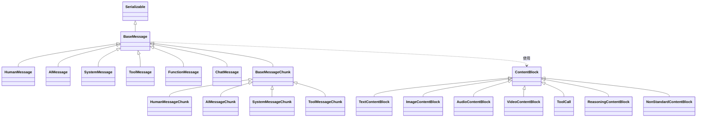
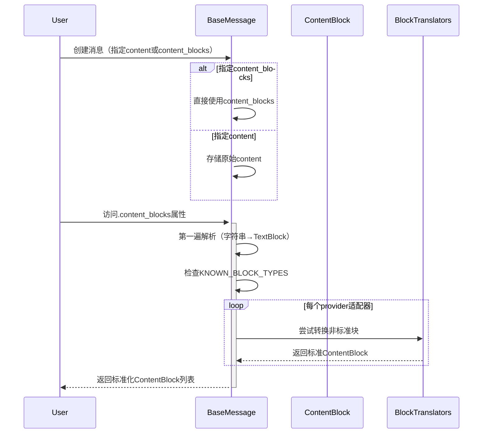
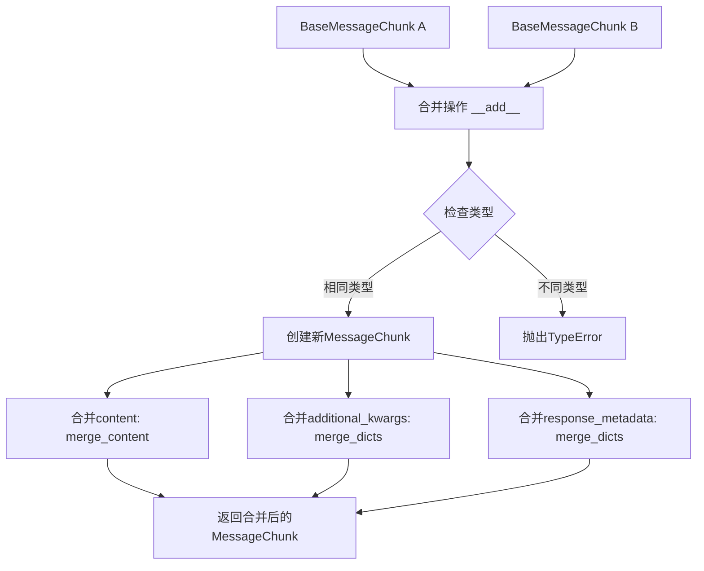
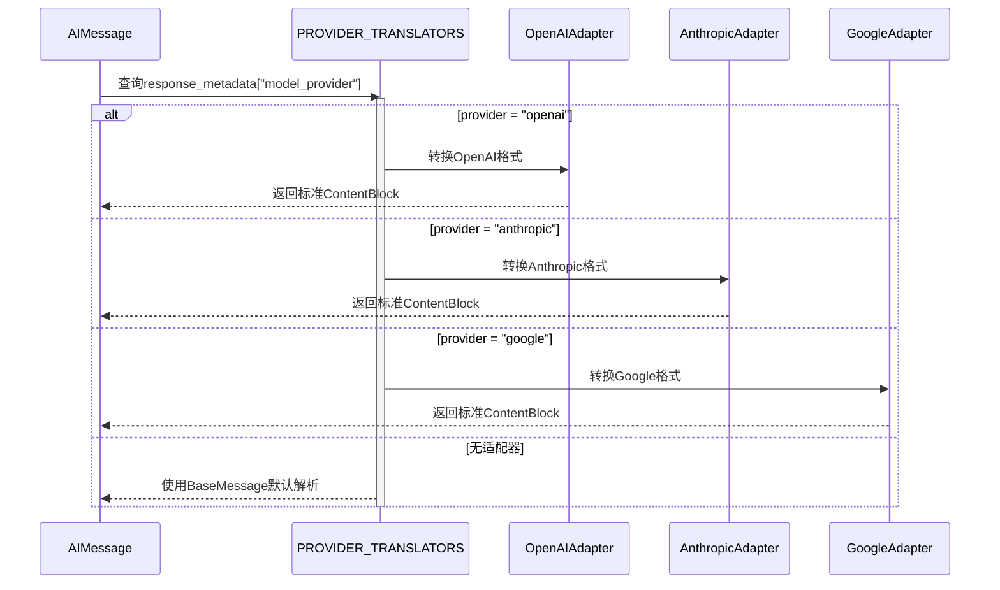
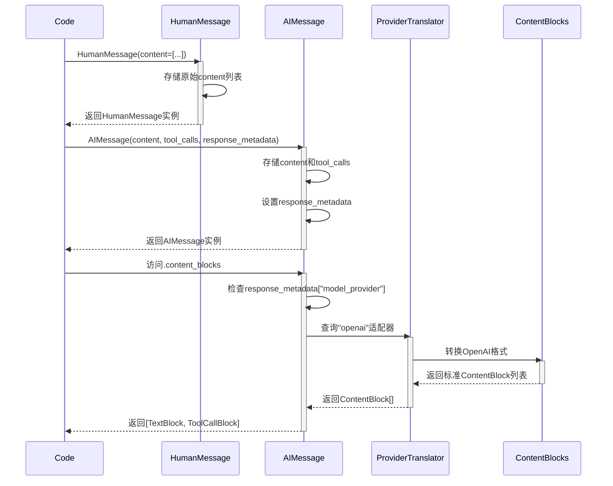

# langchain_core/messages 模块架构设计分析

> **文件位置**: `langchain_core/messages/`
> **核心功能**: 提供标准化的消息系统，支持多模态内容、流式处理和provider适配

---

## 1. 架构概览

### 1.1 模块结构图

```
langchain_core/messages/
├── 基础层 (Foundation)
│   ├── base.py              # BaseMessage, BaseMessageChunk (核心抽象)
│   └── content.py           # ContentBlock TypedDict定义 (多模态内容标准)
│
├── 消息类型层 (Message Types)
│   ├── human.py             # HumanMessage / HumanMessageChunk (用户消息)
│   ├── ai.py                # AIMessage / AIMessageChunk (AI回复)
│   ├── system.py            # SystemMessage / SystemMessageChunk (系统提示)
│   ├── tool.py              # ToolMessage / ToolMessageChunk (工具调用结果)
│   ├── function.py          # FunctionMessage (已弃用)
│   ├── chat.py              # ChatMessage (通用角色消息)
│   └── modifier.py          # RemoveMessage (消息修改操作)
│
├── 适配器层 (Provider Adapters)
│   └── block_translators/
│       ├── __init__.py      # 适配器注册机制
│       ├── openai.py        # OpenAI格式转换
│       ├── anthropic.py     # Anthropic格式转换
│       ├── google_genai.py  # Google Gemini格式转换
│       ├── bedrock.py       # AWS Bedrock格式转换
│       └── ...              # 其他provider适配器
│
└── 工具层 (Utilities)
    └── utils.py             # 消息序列化/反序列化、过滤、转换等
```

### 1.2 核心类层次结构



### 1.3 核心类定义

#### BaseMessage (base.py:93-330)

```python
class BaseMessage(Serializable):
    """消息基类，所有消息类型的抽象"""

    # 核心字段
    content: str | list[str | dict]  # 消息内容（支持字符串或多模态列表）
    additional_kwargs: dict          # provider特定数据（如tool_calls）
    response_metadata: dict          # 响应元数据（如token计数、model名称）
    type: str                        # 消息类型标识符
    name: str | None                 # 可选的消息名称
    id: str | None                   # 可选的唯一标识符

    # 核心方法
    @property
    def content_blocks(self) -> list[ContentBlock]:
        """将content解析为标准ContentBlock列表"""

    @property
    def text(self) -> TextAccessor:
        """提取文本内容"""
```

#### ContentBlock层次 (content.py)

```python
# 内容块联合类型
ContentBlock = (
    TextContentBlock |           # 文本输出
    ReasoningContentBlock |      # 推理过程
    InvalidToolCall |           # 错误的工具调用
    ToolCall |                  # 工具调用
    DataContentBlock |          # 多模态数据
    NonStandardContentBlock     # Provider特定格式
)

# 多模态数据块
DataContentBlock = (
    ImageContentBlock |         # 图片
    VideoContentBlock |         # 视频
    AudioContentBlock |         # 音频
    PlainTextContentBlock |     # 纯文本文件
    FileContentBlock            # 其他文件
)
```

---

## 2. 运作逻辑

### 2.1 消息创建与初始化流程



**关键代码路径** ([base.py:199-261](langchain_core/messages/base.py#L199-L261)):

```python
@property
def content_blocks(self) -> list[types.ContentBlock]:
    blocks: list[types.ContentBlock] = []

    # 第一遍：处理字符串和已知类型
    for item in content:
        if isinstance(item, str):
            blocks.append({"type": "text", "text": item})
        elif isinstance(item, dict):
            if item.get("type") not in types.KNOWN_BLOCK_TYPES:
                blocks.append({"type": "non_standard", "value": item})
            else:
                blocks.append(cast("types.ContentBlock", item))

    # 第二遍：依次尝试各provider适配器
    for parsing_step in [
        _convert_v0_multimodal_input_to_v1,
        _convert_to_v1_from_chat_completions_input,  # OpenAI
        _convert_to_v1_from_anthropic_input,        # Anthropic
        _convert_to_v1_from_genai_input,            # Google
        _convert_to_v1_from_converse_input,         # Bedrock
    ]:
        blocks = parsing_step(blocks)

    return blocks
```

### 2.2 消息流式合并 (BaseMessageChunk.__add__)



**关键实现** ([base.py:378-437](langchain_core/messages/base.py#L378-L437)):

```python
def __add__(self, other: Any) -> BaseMessageChunk:
    if isinstance(other, BaseMessageChunk):
        return self.__class__(
            content=merge_content(self.content, other.content),
            additional_kwargs=merge_dicts(
                self.additional_kwargs, other.additional_kwargs
            ),
            response_metadata=merge_dicts(
                self.response_metadata, other.response_metadata
            ),
        )
```

### 2.3 Content合并逻辑 (merge_content)

```mermaid
flowchart TD
    A[merge_content] --> B{first_content类型?}

    B -->|str| C{content类型?}
    B -->|list| D{content类型?}

    C -->|str| E[字符串拼接: merged += content]
    C -->|list| F[转为列表: merged = [merged, *content]]

    D -->|list| G[merge_lists递归合并]
    D -->|str且最后是str| H[merged[-1] += content]
    D -->|str且为空| I[忽略]
    D -->|str| J[append到列表]

    E --> K[返回merged]
    F --> K
    G --> K
    H --> K
    I --> K
    J --> K
```

**关键实现** ([base.py:332-372](langchain_core/messages/base.py#L332-L372)):

```python
def merge_content(
    first_content: str | list[str | dict],
    *contents: str | list[str | dict],
) -> str | list[str | dict]:
    merged = "" if first_content is None else first_content

    for content in contents:
        if isinstance(merged, str):
            if isinstance(content, str):
                merged += content
            else:
                merged = [merged, *content]
        elif isinstance(content, list):
            merged = merge_lists(merged, content)
        elif merged and isinstance(merged[-1], str):
            merged[-1] += content
        elif content == "":
            pass
        elif merged:
            merged.append(content)

    return merged
```

### 2.4 Provider适配器机制



**适配器注册** ([block_translators/__init__.py:23-54](langchain_core/messages/block_translators/__init__.py#L23-L54)):

```python
PROVIDER_TRANSLATORS: dict[str, dict[str, Callable]] = {}
# 结构: {provider: {"translate_content": func, "translate_content_chunk": func}}

def register_translator(
    provider: str,
    translate_content: Callable[[AIMessage], list[ContentBlock]],
    translate_content_chunk: Callable[[AIMessageChunk], list[ContentBlock]],
) -> None:
    PROVIDER_TRANSLATORS[provider] = {
        "translate_content": translate_content,
        "translate_content_chunk": translate_content_chunk,
    }
```

---

## 3. 简单调用示例流程

### 3.1 示例代码

```python
from langchain_core.messages import HumanMessage, AIMessage

# 1. 创建用户消息（多模态：文本+图片）
human_msg = HumanMessage(content=[
    {"type": "text", "text": "描述这张图片"},
    {"type": "image", "url": "https://example.com/image.png"}
])

# 2. 模拟AI返回（带工具调用）
ai_msg = AIMessage(
    content="我看到了一张图片",
    tool_calls=[{
        "type": "tool_call",
        "name": "search",
        "args": {"query": "图片内容分析"},
        "id": "call_123"
    }],
    response_metadata={
        "model_provider": "openai",
        "model_name": "gpt-4-vision"
    }
)

# 3. 访问content_blocks
blocks = ai_msg.content_blocks
# 自动调用OpenAI适配器解析为标准ContentBlock
```

### 3.2 调用流程图



### 3.3 关键状态转换表

| 阶段 | 数据结构 | 状态 |
|------|---------|------|
| **初始创建** | `content: str | list[dict]` | 原始provider格式 |
| **访问content_blocks** | `content_blocks: list[ContentBlock]` | 标准化格式 |
| **流式合并** | `merged_content: str | list` | 合并后的内容 |
| **序列化** | `message_to_dict(): {type, data}` | 可序列化字典 |

---

## 4. 调试断点推荐

### 断点1: BaseMessage.content_blocks (base.py:199)

**位置**: [langchain_core/messages/base.py:199](langchain_core/messages/base.py#L199)

**目的**: 观察content到ContentBlock的转换过程

**能观察到的状态**:
```python
# 原始content
self.content = "Hello world"
# 或
self.content = [
    {"type": "text", "text": "Hello"},
    {"type": "image_url", "image_url": {"url": "..."}}
]

# 转换后
blocks = [
    {"type": "text", "text": "Hello world"}
]
# 或
blocks = [
    {"type": "text", "text": "Hello"},
    {"type": "non_standard", "value": {...}}  # 未识别的类型
]

# 经过适配器后
blocks = [
    {"type": "text", "text": "Hello"},
    {"type": "image", "url": "..."}  # 被OpenAI适配器转换
]
```

**调试技巧**:
- 检查`self.content`的原始格式
- 观察哪些block被标记为`non_standard`
- 验证provider适配器是否正确转换

### 断点2: BaseMessageChunk.__add__ (base.py:378)

**位置**: [langchain_core/messages/base.py:378](langchain_core/messages/base.py#L378)

**目的**: 观察流式消息合并逻辑

**能观察到的状态**:
```python
# 合并前
self.content = "Hello"
other.content = " World"

# 合并后
return self.__class__(
    content="Hello World",  # merge_content结果
    additional_kwargs=merge_dicts(...),
    response_metadata=merge_dicts(...)
)

# 多模态内容合并
self.content = [{"type": "text", "text": "Hello"}]
other.content = [{"type": "image", "url": "..."}]

# 结果
content = [
    {"type": "text", "text": "Hello"},
    {"type": "image", "url": "..."}
]
```

**调试技巧**:
- 验证`merge_content`是否正确处理字符串和列表
- 检查tool_calls的合并（按index匹配）
- 观察元数据是否正确累加

### 断点3: merge_content (base.py:332)

**位置**: [langchain_core/messages/base.py:332](langchain_core/messages/base.py#L332)

**目的**: 观察content合并的详细逻辑

**能观察到的状态**:
```python
# 场景1: 字符串合并
first_content = "Hello"
contents = (" World", "!")
# 结果: "Hello World!"

# 场景2: 列表合并
first_content = [{"type": "text", "text": "Hello"}]
contents = ([{"type": "image", "url": "..."}],)
# 结果: [{"type": "text", "text": "Hello"}, {"type": "image", "url": "..."}]

# 场景3: 混合合并
first_content = "Hello"
contents = ([{"type": "image", "url": "..."}],)
# 结果: ["Hello", {"type": "image", "url": "..."}]
```

**调试技巧**:
- 检查类型判断逻辑是否正确
- 验证边界情况（空字符串、空列表）
- 观察merge_dicts和merge_lists的调用

---

## 5. 自定义新组件指南

### 5.1 继承哪个类？

**场景分析**:

| 需求 | 继承类 | 原因 |
|------|--------|------|
| 全新的消息类型（如"AssistantMessage"） | `BaseMessage` | 完全自定义消息行为 |
| 现有类型的扩展（如带特定字段的HumanMessage） | `HumanMessage` | 复用现有类型和验证逻辑 |
| 支持流式处理的消息类型 | `BaseMessageChunk` | 自动支持`__add__`合并 |
| 自定义ContentBlock类型 | 无需继承 | 直接定义TypedDict |

### 5.2 最少需要重写的方法

#### 场景1: 自定义消息类型（继承BaseMessage）

```python
from typing import Any, Literal
from langchain_core.messages.base import BaseMessage

class CustomMessage(BaseMessage):
    """自定义消息类型示例"""

    # 1. 必须定义type字段
    type: Literal["custom"] = "custom"

    # 2. 可选：添加自定义字段
    custom_field: str | None = None

    # 3. 可选：重写__init__以处理自定义初始化
    def __init__(
        self,
        content: str | list[str | dict],
        custom_field: str | None = None,
        **kwargs: Any,
    ) -> None:
        super().__init__(content=content, **kwargs)
        self.custom_field = custom_field

    # 4. 可选：重写content_blocks以自定义解析逻辑
    @property
    def content_blocks(self) -> list[ContentBlock]:
        # 如果需要特殊解析逻辑，重写此方法
        # 否则使用BaseMessage的默认实现
        return super().content_blocks
```

**最少重写**: 只需定义`type`字段！

#### 场景2: 支持流式处理（继承BaseMessageChunk）

```python
from langchain_core.messages.base import BaseMessageChunk

class CustomMessageChunk(BaseMessageChunk):
    """支持流式合并的自定义消息"""

    type: Literal["custom_chunk"] = "custom_chunk"

    # 1. 可选：重写__add__以自定义合并逻辑
    def __add__(self, other: Any) -> BaseMessageChunk:
        if isinstance(other, CustomMessageChunk):
            # 自定义合并逻辑
            return self.__class__(
                content=merge_content(self.content, other.content),
                custom_field=merge_custom(self.custom_field, other.custom_field),
            )
        return super().__add__(other)
```

**最少重写**: 无需重写，`BaseMessageChunk`已提供默认合并逻辑！

#### 场景3: 自定义ContentBlock

```python
from typing_extensions import TypedDict, NotRequired, Literal

class CustomContentBlock(TypedDict):
    """自定义内容块"""

    type: Literal["custom_block"]  # 必需：类型标识
    id: NotRequired[str]           # 可选：唯一标识
    data: str                      # 必需：自定义数据
    extras: NotRequired[dict]      # 可选：provider特定元数据

# 使用工厂函数创建
def create_custom_block(data: str, **kwargs) -> CustomContentBlock:
    return CustomContentBlock(
        type="custom_block",
        id=ensure_id(kwargs.get("id")),
        data=data,
        **{k: v for k, v in kwargs.items() if v is not None}
    )
```

### 5.3 完整示例：自定义"ThinkingMessage"

```python
from typing import Any, Literal
from langchain_core.messages.base import BaseMessage, BaseMessageChunk
from langchain_core.messages import content as types

class ThinkingMessage(BaseMessage):
    """表示AI思考过程的消息类型"""

    type: Literal["thinking"] = "thinking"

    # 自定义字段
    thought_process: list[str] = []
    confidence_score: float | None = None

    def __init__(
        self,
        content: str | list[str | dict],
        thought_process: list[str] | None = None,
        confidence_score: float | None = None,
        **kwargs: Any,
    ) -> None:
        super().__init__(content=content, **kwargs)
        self.thought_process = thought_process or []
        self.confidence_score = confidence_score

    @property
    def content_blocks(self) -> list[types.ContentBlock]:
        """将思考过程转换为标准ContentBlock"""
        blocks = super().content_blocks

        # 添加思考过程作为ReasoningContentBlock
        if self.thought_process:
            blocks.append({
                "type": "reasoning",
                "reasoning": "\n".join(self.thought_process),
                "id": ensure_id()
            })

        return blocks

class ThinkingMessageChunk(ThinkingMessage, BaseMessageChunk):
    """支持流式的ThinkingMessage"""

    type: Literal["ThinkingMessageChunk"] = "ThinkingMessageChunk"

    def __add__(self, other: Any) -> BaseMessageChunk:
        """合并思考步骤"""
        if isinstance(other, ThinkingMessageChunk):
            return self.__class__(
                content=merge_content(self.content, other.content),
                thought_process=self.thought_process + other.thought_process,
                confidence_score=other.confidence_score or self.confidence_score,
            )
        return super().__add__(other)
```

### 5.4 注册自定义Provider适配器

```python
from langchain_core.messages.block_translators import register_translator

def translate_custom_content(message: AIMessage) -> list[ContentBlock]:
    """将自定义provider格式转换为标准ContentBlock"""
    blocks = []

    for item in message.content:
        if isinstance(item, dict):
            if item.get("type") == "custom_thinking":
                blocks.append({
                    "type": "reasoning",
                    "reasoning": item["thought_text"]
                })
            else:
                blocks.append(item)

    return blocks

# 注册适配器
register_translator(
    provider="my_custom_provider",
    translate_content=translate_custom_content,
    translate_content_chunk=translate_custom_content  # 通常相同
)
```

---

## 6. 关键设计模式

### 6.1 模板方法模式

- **定义**: `BaseMessage`定义算法骨架，子类实现细节
- **示例**: `content_blocks`属性定义解析流程，provider适配器实现具体转换

### 6.2 适配器模式

- **定义**: 将不同provider的API格式转换为统一接口
- **示例**: `block_translators/`模块中的各provider适配器

### 6.3 工厂模式

- **定义**: 通过工厂函数创建ContentBlock
- **示例**: `create_text_block()`, `create_image_block()`等

### 6.4 策略模式

- **定义**: 根据provider选择不同的解析策略
- **示例**: `PROVIDER_TRANSLATORS`字典存储各provider的策略

### 6.5 责任链模式

- **定义**: 依次尝试多个解析器，直到成功
- **示例**: `content_blocks`中的多步解析循环

---

## 7. 重要特性

### 7.1 多模态支持

- **ContentBlock系统**: 统一的 TypedDict 接口
- **支持类型**: 文本、图片、音频、视频、文件
- **扩展性**: 通过`NonStandardContentBlock`支持未定义类型

### 7.2 流式处理

- **BaseMessageChunk**: 所有Chunk类型的基类
- **自动合并**: 通过`__add__`操作符合并流式片段
- **智能合并**: `merge_content`处理字符串和列表的多种组合

### 7.3 Provider兼容

- **适配器机制**: 自动识别provider并转换格式
- **向后兼容**: 支持v0格式的旧版multimodal内容
- **最佳努力**: 无适配器时使用通用解析

### 7.4 序列化

- **继承Serializable**: 支持完整的序列化/反序列化
- **类型安全**: 通过`type`字段确保反序列化正确性
- **标准格式**: `{type: str, data: dict}`

---

## 8. 总结

### 核心优势

1. **统一接口**: 屏蔽不同provider的差异
2. **类型安全**: 广泛使用TypedDict和类型提示
3. **可扩展性**: 易于添加新消息类型和provider适配器
4. **流式支持**: 原生支持流式处理和消息合并
5. **多模态**: 统一的多模态内容表示

### 关键文件索引

| 文件 | 行号 | 功能 |
|------|------|------|
| [base.py](langchain_core/messages/base.py) | 93-330 | BaseMessage核心定义 |
| [base.py](langchain_core/messages/base.py) | 199-261 | content_blocks解析逻辑 |
| [base.py](langchain_core/messages/base.py) | 332-372 | merge_content合并逻辑 |
| [base.py](langchain_core/messages/base.py) | 378-437 | BaseMessageChunk.__add__ |
| [content.py](langchain_core/messages/content.py) | 1-1423 | ContentBlock TypedDict定义 |
| [block_translators/__init__.py](langchain_core/messages/block_translators/__init__.py) | 23-71 | 适配器注册机制 |
| [ai.py](langchain_core/messages/ai.py) | 159-200 | AIMessage实现 |
| [human.py](langchain_core/messages/human.py) | 9-71 | HumanMessage实现 |
| [tool.py](langchain_core/messages/tool.py) | 26-172 | ToolMessage实现 |

### 扩展建议

1. **新消息类型**: 继承`BaseMessage`，定义`type`字段
2. **新ContentBlock**: 定义TypedDict，添加到`ContentBlock`联合类型
3. **新Provider适配器**: 实现`translate_content`和`translate_content_chunk`
4. **自定义合并逻辑**: 继承`BaseMessageChunk`，重写`__add__`
