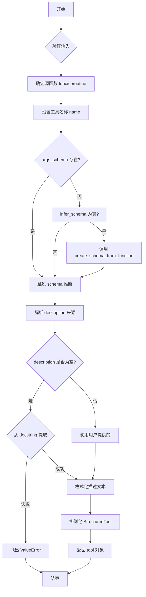

# StructuredTool.from_function 方法分析

## 一、方法概览

**文件位置**: `langchain_core/tools/structured.py`

`from_function` 是 `StructuredTool` 的类方法,用于将普通 Python 函数或异步协程转换为 LangChain 工具对象。

## 二、业务逻辑

### 核心目标
将用户定义的函数封装成一个具有类型安全的结构化工具,该工具:
- 自动推断参数schema
- 自动提取文档描述
- 支持同步和异步执行
- 提供运行时参数验证

### 主要职责
1. **Schema 自动推断**: 从函数签名自动生成 Pydantic 数据模型
2. **元数据提取**: 从函数名和 docstring 提取工具名称和描述
3. **参数过滤**: 自动过滤框架内部参数 (如 callbacks, run_manager)
4. **类型安全**: 通过 Pydantic 实现参数类型检查和验证

## 三、执行流程



### 详细步骤

#### 1. 参数校验与源函数确定
```python
if func is not None:
    source_function = func
elif coroutine is not None:
    source_function = coroutine
else:
    raise ValueError("Function and/or coroutine must be provided")
```

#### 2. Schema 推断 (核心)
```python
if args_schema is None and infer_schema:
    args_schema = create_schema_from_function(
        name,
        source_function,
        parse_docstring=parse_docstring,
        error_on_invalid_docstring=error_on_invalid_docstring,
        filter_args=_filter_schema_args(source_function),
    )
```

#### 3. 描述信息处理
优先级:
1. 用户显式提供的 `description`
2. 从 `args_schema` 中提取
3. 从函数 `__doc__` 中提取

#### 4. 工具实例化
```python
return cls(
    name=name,
    func=func,
    coroutine=coroutine,
    args_schema=args_schema,
    description=description_,
    return_direct=return_direct,
    response_format=response_format,
    **kwargs,
)
```

## 四、相关技术点

### 4.1 Pydantic Schema 自动推断

#### 核心流程 (`create_schema_from_function`)

**步骤 1**: 使用 Pydantic 的 `validate_arguments` 装饰器自动从函数签名创建模型
```python
validated = validate_arguments(func, config=_SchemaConfig)
inferred_model = validated.model
```

**步骤 2**: 过滤不需要暴露的字段
```python
filter_args_ = ["run_manager", "callbacks", "config"]
```

**步骤 3**: 创建子集模型
```python
return _create_subset_model(
    model_name,
    inferred_model,
    list(valid_properties),
    descriptions=arg_descriptions,
)
```

#### 4.2 运行时参数校验

**调用时**: 在 `_parse_input` 方法中验证

**校验流程**:
```python
# 检查输入类型
if isinstance(tool_input, str):
    # 单参数快捷方式: 验证并返回字符串
    input_args.model_validate({key_: tool_input})
else:
    # 多参数: 验证字典输入
    result = input_args.model_validate(tool_input)
    result_dict = result.model_dump()
```

**验证内容**:
- ✅ 参数类型是否匹配 (int, str, List[T] 等)
- ✅ 必填参数是否提供
- ✅ 参数约束 (Range, Length, Pattern 等)
- ✅ 自定义验证器
- ✅ 嵌套模型验证

#### 4.3 参数过滤机制

**过滤目标** (`_filter_schema_args`):
```python
FILTERED_ARGS = ("run_manager", "callbacks")
```

**额外过滤**:
- `self` / `cls` (类方法/实例方法)
- `config` (RunnableConfig)
- 自定义注入参数 (InjectedToolCallId)

**效果**: 框架内部参数不出现在 API schema 中,但运行时会自动注入

#### 4.4 文档解析增强

支持从 Google Style docstring 提取参数描述:
```python
"""搜索 API

Args:
    query: 搜索查询字符串
    limit: 返回结果数量上限

Returns:
    搜索结果列表
"""
```

当 `parse_docstring=True` 时,自动提取参数描述并附加到 schema 中。

### 4.5 Pydantic 集成的关键设计

#### 类型提示转换
```python
def add(a: int, b: int) -> int:
    """Add two numbers"""
    return a + b
```

转换为:
```python
class AddInput(BaseModel):
    a: int = Field(description="")
    b: int = Field(description="")
```

#### SkipValidation 标记
```python
args_schema: Annotated[ArgsSchema, SkipValidation()] = Field(...)
```

防止 Pydantic 对 `args_schema` 本身进行二次验证 (避免递归)。

#### 兼容性处理
```python
if issubclass(model, BaseModelV1):
    return _create_subset_model_v1(...)
return _create_subset_model_v2(...)
```

同时支持 Pydantic v1 和 v2 两个版本。

## 五、LangChain 如何利用 Pydantic 做运行时参数校验

### 5.1 校验时机

**阶段 1**: 工具创建时
- 从函数签名生成 Pydantic Model
- 建立类型映射关系

**阶段 2**: 工具调用时 (BaseTool._parse_input)
```python
result = input_args.model_validate(tool_input)
result_dict = result.model_dump()
```

### 5.2 校验内容

1. **类型检查**: 确保输入值符合类型注解
2. **必需性检查**: 缺少必填参数时抛出 ValidationError
3. **约束验证**: Field 定义的约束
   ```python
   age: int = Field(ge=0, le=150)  # 0 ≤ age ≤ 150
   email: str = Field(pattern=r"^[\w\.-]+@[\w\.-]+\.\w+$")
   ```
4. **嵌套验证**: 递归验证嵌套对象

### 5.3 错误处理

验证失败时,Pydantic 抛出 `ValidationError`:
```python
try:
    validated = schema.model_validate(input_data)
except ValidationError as e:
    # 返回详细错误信息
    raise ValueError(f"Invalid input: {e}")
```

### 5.4 注入参数处理

特殊参数 (如 InjectedToolCallId) 的处理:
```python
if _is_injected_arg_type(v, injected_type=InjectedToolCallId):
    if tool_call_id is None:
        raise ValueError("...")
    tool_input[k] = tool_call_id  # 自动注入
```

### 5.5 类型提示增强

```python
from typing import Annotated
from pydantic import Field

def search(
    query: Annotated[str, Field(description="Search query string")],
    limit: Annotated[int, Field(ge=1, le=100, description="Max results")] = 10,
) -> str:
    """Search for something."""
    return f"Results for: {query}"
```

LangChain 会保留这些 Field 元数据并合并到生成的 schema 中。

## 六、关键代码片段

### Schema 推断核心
```python
# langchain_core/tools/base.py
validated = validate_arguments(func, config=_SchemaConfig)
inferred_model = validated.model

return _create_subset_model(
    model_name,
    inferred_model,
    list(valid_properties),
    descriptions=arg_descriptions,
)
```

### 运行时校验核心
```python
# langchain_core/tools/base.py - BaseTool._parse_input
result = input_args.model_validate(tool_input)
result_dict = result.model_dump()
validated_input = {k: getattr(result, k) for k in result_dict if k in tool_input}
```

### 执行时参数注入
```python
# langchain_core/tools/structured.py - StructuredTool._run
if run_manager and signature(self.func).parameters.get("callbacks"):
    kwargs["callbacks"] = run_manager.get_child()
if config_param := _get_runnable_config_param(self.func):
    kwargs[config_param] = config
return self.func(*args, **kwargs)
```

## 七、总结

`StructuredTool.from_function` 通过以下机制实现强大的工具构建能力:

1. **Pydantic 自动推断**: 从函数签名自动生成类型安全的 Schema
2. **运行时校验**: 调用时自动验证输入,保证类型安全
3. **智能过滤**: 自动隐藏框架内部参数,简化 API
4. **文档集成**: 自动提取并格式化描述信息
5. **双异步支持**: 同时支持同步和异步函数

这种设计让开发者只需编写普通 Python 函数,就能获得完整的类型安全、参数验证和元数据管理的 LangChain 工具。
